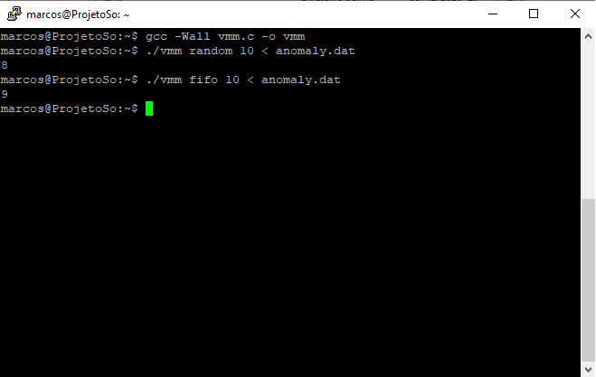
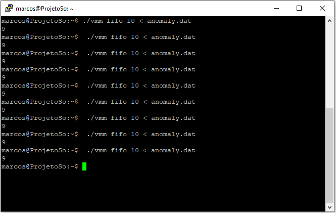

# :computer: Gerenciador de Memória

Projeto desenvolvido para a disciplina de Sistemas Operacionais, do curso de Sistemas de Informação da Universidade Federal de Viçosa - Campus Rio Paranaíba.
- Marcos Aurélio Duarte Souza | 5165
- Matheus Medeiros Santana | 5188

[:link: Link do respositírio](https://github.com/matheus6d/gerenciador-memoria)

## :arrow_forward: Execução do Algorítimo

Existem dois arquivos importantes para execução do código: "vmm.c" e "anomaly.dat".
Para executar, digite o comando: 

```
$ gcc -Wall vmm.c -o vmm
```
O comando a cima, gera o arquivo para ser executado. Para acessar o programa, utilizaremos o código:

```
$ ./vmm [FUNCAO] 10 < anomaly.dat
```
Ao inserir esse código, estamos passando para a função os parametros necessários para serem analisados.
Em [FUNCAO] substitua por:
- random: caso queira utilizar a função fornecida pelo professor;
- fifo: para utilizar a função implementada pelos autores do projeto.



## :memo: Função FIFO implementada pelos autores

```
int fifo(int8_t** page_table, int num_pages, int prev_page, int fifo_frm, int num_frames, int clock) {
         
         int i; //Incrementador 

		 do {
		 	//Se o endereço físico é o mais velho para ser retornado
		 	if(page_table[i][PT_FRAMEID] == 0){
         		return i;
			 }
			 
			 ++i; //Incrementa para o próximo
			 
		 } while (i < num_pages); //Roda até encontrar a página vitima
		 	 	
    return -1;
}

```
_O algoritmo de troca de página FIFO - First in, First out, tem como objetivo a removeção das páginas de memória mais antigas, fazendo com que o primeiro que entre seja o primeiro que será removido. Uma caracterisca desse algoritmo o seu baixo custo é a simplicidade em sua implementação, por outro lado é que a página mais antiga pode ser usada frequentemente, causando um aumento de page fault_

## :mag_right: RANDOM _versus_ FIFO

:arrow_right: **FIFO - First in First out**

text



:arrow_right: **RANDOM**

text


### :page_facing_up: Tabela de Resultados

| Execução | Page Fault FIFO | Page Fault RANDOM |
|:----------|:-------------:|:------:|
| 1| 9 | 7 |
| 2| 9 | 8 |
| 3| 9| 10 |
| 4| 9 | 8 | 
| 5| 9 | 10 |
| 6| 9 | 9 |
| 7|9 | 8 |
| 8| 9 | 8 |
| 9| 9| 9 | 
| 10| 9 | 9 | 
| MÉDIA| 9 | 9,5 | 

Analisando a execução dos dois algorítimos, podemos perceber que o fifo apresenta uma constância no page fault, enquanto o random varia entre 7 a 10 page fault.
Foram executadas 10 vezes os códigos tendo como entrada o arquivo anomaly.dat. Por não possuir uma variedade maior de entradas, o resultado não foi tão discrepante entre a média de page fault do algorítmo proposto pelo professor e o desenvolvido pelos autores.

Pelas analies no ambiente de maquina virtual Azure, com sistema operacional ubuntu, pudemos identificar que o fifo foi ligeiramente melhor que o random. 
